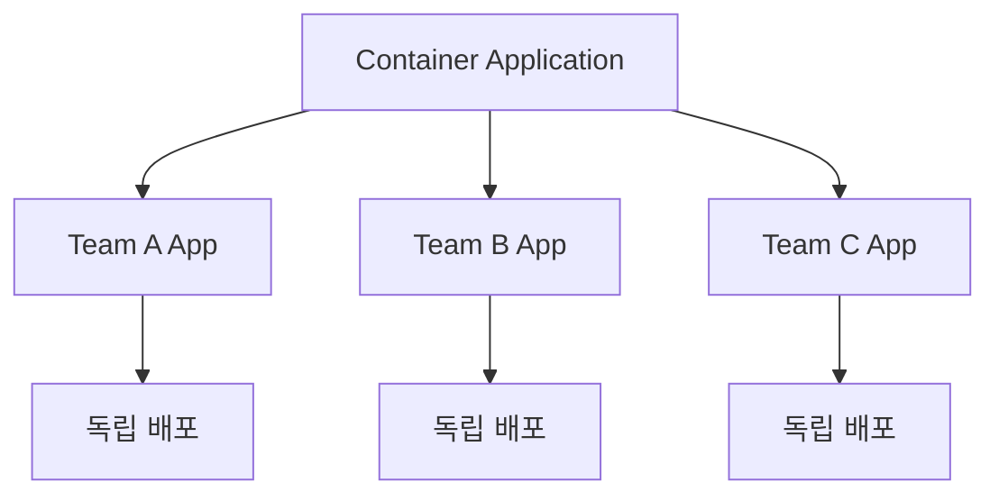

# 마이크로 프론트엔드 기초: 개념과 아키텍처

마이크로 프론트엔드는 웹 애플리케이션을 더 작고 관리하기 쉬운 단위로 분할하는 아키텍처 스타일입니다.

## 1. 마이크로 프론트엔드란?

### 1.1 핵심 개념

마이크로 프론트엔드는 다음과 같은 특징을 가집니다:

- 독립적인 배포 가능성
- 팀의 자율성
- 기술 스택의 유연성
- 점진적 업그레이드 용이성



### 1.2 모노리스와의 비교

```javascript
// 모노리스 방식
const MonolithApp = () => {
  return (
    <div>
      <Header />
      <ProductList />
      <ShoppingCart />
      <UserProfile />
      <Footer />
    </div>
  );
};

// 마이크로 프론트엔드 방식
const MicroFrontendApp = () => {
  return (
    <div>
      <TeamAHeader />
      <TeamBProducts />
      <TeamCCart />
      <TeamDProfile />
      <SharedFooter />
    </div>
  );
};
```

## 2. 아키텍처 패턴

### 2.1 컴포지션 패턴

```javascript
// 런타임 통합
import { mountTeamApp } from '@team/app';

class MicroFrontend extends HTMLElement {
  connectedCallback() {
    const name = this.getAttribute('name');
    const host = this.getAttribute('host');
    
    // 동적으로 스크립트 로드
    const scriptId = `micro-frontend-script-${name}`;
    
    if (document.getElementById(scriptId)) {
      this.renderMicroFrontend(name, host);
      return;
    }
    
    fetch(`${host}/asset-manifest.json`)
      .then(res => res.json())
      .then(manifest => {
        const script = document.createElement('script');
        script.id = scriptId;
        script.src = `${host}${manifest['main.js']}`;
        script.onload = () => {
          this.renderMicroFrontend(name, host);
        };
        document.head.appendChild(script);
      });
  }
  
  renderMicroFrontend(name, host) {
    mountTeamApp(name, this, host);
  }
}

customElements.define('micro-frontend', MicroFrontend);
```

### 2.2 라우팅 기반 통합

```typescript
// App.tsx
import { lazy, Suspense } from 'react';
import { BrowserRouter, Route, Routes } from 'react-router-dom';

const TeamAApp = lazy(() => import('@team-a/app'));
const TeamBApp = lazy(() => import('@team-b/app'));
const TeamCApp = lazy(() => import('@team-c/app'));

function App() {
  return (
    <BrowserRouter>
      <Suspense fallback={<Loading />}>
        <Routes>
          <Route path="/team-a/*" element={<TeamAApp />} />
          <Route path="/team-b/*" element={<TeamBApp />} />
          <Route path="/team-c/*" element={<TeamCApp />} />
        </Routes>
      </Suspense>
    </BrowserRouter>
  );
}
```

## 3. 통신과 상태 관리

### 3.1 커스텀 이벤트

```javascript
// 이벤트 기반 통신
class MicroFrontendBus {
  constructor() {
    this.events = {};
  }
  
  subscribe(event, callback) {
    if (!this.events[event]) {
      this.events[event] = [];
    }
    this.events[event].push(callback);
    
    return () => {
      this.events[event] = this.events[event]
        .filter(cb => cb !== callback);
    };
  }
  
  publish(event, data) {
    if (this.events[event]) {
      this.events[event].forEach(callback => {
        callback(data);
      });
    }
  }
}

// 사용 예시
const bus = new MicroFrontendBus();

// Team A의 구현
bus.subscribe('cart:updated', (data) => {
  console.log('Cart updated:', data);
});

// Team B의 발행
bus.publish('cart:updated', { items: ['item1', 'item2'] });
```

### 3.2 공유 상태 관리

```typescript
// 공유 상태 관리자
class SharedStateManager {
  private state: Map<string, any>;
  private subscribers: Map<string, Set<Function>>;
  
  constructor() {
    this.state = new Map();
    this.subscribers = new Map();
  }
  
  setState(key: string, value: any) {
    this.state.set(key, value);
    this.notifySubscribers(key);
  }
  
  getState(key: string) {
    return this.state.get(key);
  }
  
  subscribe(key: string, callback: Function) {
    if (!this.subscribers.has(key)) {
      this.subscribers.set(key, new Set());
    }
    this.subscribers.get(key)?.add(callback);
    
    return () => {
      this.subscribers.get(key)?.delete(callback);
    };
  }
  
  private notifySubscribers(key: string) {
    const value = this.state.get(key);
    this.subscribers.get(key)?.forEach(callback => {
      callback(value);
    });
  }
}

// 사용 예시
const sharedState = new SharedStateManager();

// Team A
sharedState.subscribe('user', (user) => {
  console.log('User updated:', user);
});

// Team B
sharedState.setState('user', {
  id: 1,
  name: 'John'
});
```

## 4. 스타일링 전략

### 4.1 CSS 격리

```javascript
// CSS Modules 사용
import styles from './TeamApp.module.css';

function TeamApp() {
  return (
    <div className={styles.container}>
      <h1 className={styles.title}>Team App</h1>
    </div>
  );
}

// Shadow DOM 사용
class IsolatedComponent extends HTMLElement {
  constructor() {
    super();
    const shadow = this.attachShadow({ mode: 'closed' });
    
    const style = document.createElement('style');
    style.textContent = `
      .container { padding: 20px; }
      .title { color: blue; }
    `;
    
    const container = document.createElement('div');
    container.setAttribute('class', 'container');
    container.innerHTML = '<h1 class="title">Isolated Component</h1>';
    
    shadow.appendChild(style);
    shadow.appendChild(container);
  }
}

customElements.define('isolated-component', IsolatedComponent);
```

다음 포스트에서는 마이크로 프론트엔드의 통합 전략에 대해 더 자세히 알아보겠습니다. 