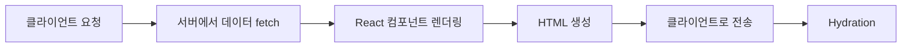

# SSR 심층 분석: 서버 사이드 렌더링의 모든 것

서버 사이드 렌더링(SSR)은 현대 웹 개발에서 중요한 렌더링 전략입니다. 이번 글에서는 SSR의 내부 동작 원리와 최적화 방법을 자세히 알아보겠습니다.

## 1. SSR의 동작 원리

### 1.1 렌더링 프로세스



### 1.2 Hydration 과정

```javascript
// 서버 사이드 렌더링 결과
const ServerComponent = () => {
  return (
    <div id="root">
      <h1>서버에서 렌더링된 내용</h1>
      <p>이 내용은 초기 HTML에 포함됩니다.</p>
    </div>
  );
};

// 클라이언트 사이드 Hydration
import { hydrateRoot } from 'react-dom/client';

const ClientComponent = () => {
  const [count, setCount] = useState(0);
  
  return (
    <div id="root">
      <h1>서버에서 렌더링된 내용</h1>
      <p>이 내용은 초기 HTML에 포함됩니다.</p>
      <button onClick={() => setCount(count + 1)}>
        클릭: {count}
      </button>
    </div>
  );
};

// Hydration 수행
hydrateRoot(
  document.getElementById('root'),
  <ClientComponent />
);
```

## 2. Next.js의 SSR 구현

### 2.1 기본 SSR 설정

```typescript
// pages/api/data.ts
import type { NextApiRequest, NextApiResponse } from 'next';

export default async function handler(
  req: NextApiRequest,
  res: NextApiResponse
) {
  const data = await fetchData();
  res.status(200).json(data);
}

// pages/index.tsx
export async function getServerSideProps() {
  // API 라우트 대신 직접 데이터 fetch
  const data = await fetchData();
  
  return {
    props: {
      data,
      generatedAt: new Date().toISOString(),
    }
  };
}
```

### 2.2 스트리밍 SSR

```typescript
// app/page.tsx
import { Suspense } from 'react';

async function SlowComponent() {
  const data = await fetchSlowData();
  return <div>{data}</div>;
}

export default function Page() {
  return (
    <>
      <h1>즉시 로드되는 콘텐츠</h1>
      <Suspense fallback={<Loading />}>
        <SlowComponent />
      </Suspense>
    </>
  );
}
```

## 3. SSR 최적화 전략

### 3.1 캐싱 전략

```typescript
// 캐시 제어
export async function getServerSideProps({ req, res }) {
  res.setHeader(
    'Cache-Control',
    'public, s-maxage=10, stale-while-revalidate=59'
  );
  
  const data = await fetchData();
  
  return {
    props: {
      data,
      generatedAt: new Date().toISOString(),
    },
  };
}

// 데이터 캐싱
const cache = new Map();

async function fetchWithCache(key: string) {
  if (cache.has(key)) {
    return cache.get(key);
  }
  
  const data = await fetchData(key);
  cache.set(key, data);
  return data;
}
```

### 3.2 선택적 SSR

```typescript
// 조건부 SSR
export async function getServerSideProps({ req }) {
  // 봇 감지
  const userAgent = req.headers['user-agent'] || '';
  const isBot = /bot|crawler|spider|googlebot/i.test(userAgent);
  
  if (!isBot) {
    // 일반 사용자는 CSR로 처리
    return {
      props: {
        initialData: null,
      },
    };
  }
  
  // 봇에게는 완전한 SSR 제공
  const data = await fetchData();
  return {
    props: {
      initialData: data,
    },
  };
}
```

## 4. 성능 최적화

### 4.1 번들 최적화

```typescript
// 동적 임포트
import dynamic from 'next/dynamic';

const HeavyComponent = dynamic(() => import('./HeavyComponent'), {
  loading: () => <p>Loading...</p>,
  ssr: false, // 클라이언트 사이드에서만 로드
});

// 모듈 프리로딩
const PreloadedComponent = dynamic(() => import('./PreloadedComponent'), {
  loading: () => <p>Loading...</p>,
  ssr: true,
});

// 컴포넌트가 필요하기 전에 미리 로드
const preloadComponent = () => {
  const componentPromise = import('./PreloadedComponent');
  return componentPromise;
};
```

### 4.2 데이터 프리페칭

```typescript
// 데이터 프리페칭 구현
export async function getServerSideProps({ req }) {
  const session = await getSession(req);
  
  // 병렬로 데이터 fetch
  const [userData, postsData, settingsData] = await Promise.all([
    fetchUserData(session.userId),
    fetchUserPosts(session.userId),
    fetchUserSettings(session.userId),
  ]);
  
  return {
    props: {
      user: userData,
      posts: postsData,
      settings: settingsData,
    },
  };
}
```

## 5. 모니터링과 디버깅

```typescript
// 서버 사이드 렌더링 성능 모니터링
import { performance } from 'perf_hooks';

export async function getServerSideProps({ req }) {
  const start = performance.now();
  
  try {
    const data = await fetchData();
    
    const duration = performance.now() - start;
    console.log(`SSR took ${duration}ms`);
    
    return {
      props: { data },
    };
  } catch (error) {
    console.error('SSR Error:', error);
    return {
      props: { error: error.message },
    };
  }
}
```

다음 포스트에서는 CSR 최적화 전략에 대해 알아보겠습니다. 